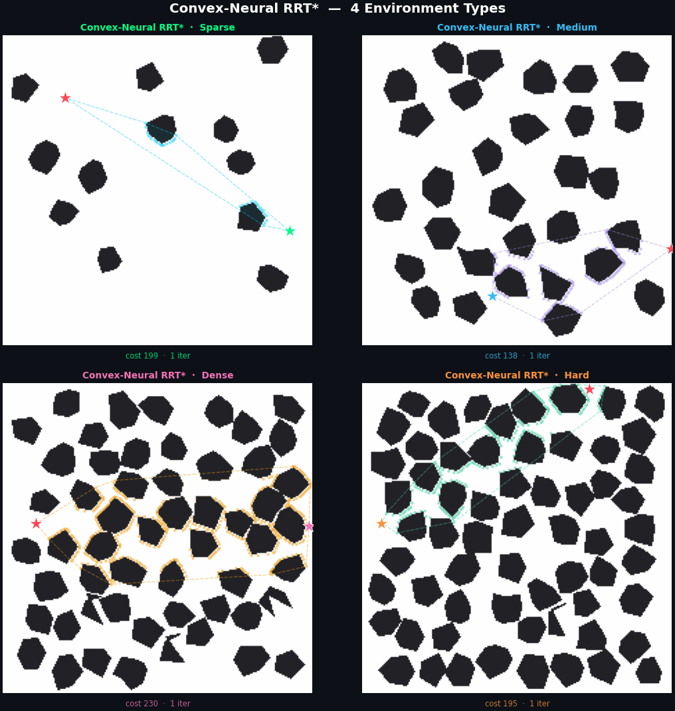

<div align="center">

<h1>Convex-Neural RRT*</h1>
<h3>Fast and Reliable Learning-Guided Sampling for High-Quality Robot Path Planning</h3>

<p>
  <a href="https://doi.org/10.1109/ACCESS.2024.0429000"></a>
  <a href="https://www.python.org/"></a>
  <a href="https://pytorch.org/"></a>
  <a href="LICENSE"></a>
</p>

<p>
  <b>Hichem Cheriet</b> · Badra Khellat Kihel · Samira Chouraqui · Bara J. Emran<br/>
  <i>USTO-MB University, Algeria · Oran 2 University · American University of Sharjah</i>
</p>



</div>

---

## Abstract

Sampling-based algorithms for robot path planning offer probabilistic completeness and strong empirical convergence properties across environments with diverse obstacle configurations. However, in practice, these methods often require many iterations to obtain high-quality solutions. This paper proposes **Convex-Neural RRT\***, an enhanced RRT\* variant that incorporates neural guidance to predict informative waypoint regions near high-quality paths. Convex candidate regions are extracted from these predictions, enabling the planner to concentrate exploration on geometrically relevant areas while preserving global exploration.

> Convex-Neural RRT\* reduces computation time by **30–75%** compared to neural-guided variants and up to **88–98%** relative to LTA\*, while achieving an average path length reduction of approximately **5%** compared to classical RRT\*, with a success rate above **99%** across varying obstacle densities.

---

## ✨ Key Contributions

- 🧠 **Neural guidance** — A U-Net (ResNet50 encoder) predicts informative waypoint regions from the occupancy map, enabling focused sampling near high-quality paths
- 📐 **Convex-guided hybrid exploration** — Convex corners are extracted from predicted regions; a convex hull partitions them into *inside* (exploitation) and *outside* (exploration) sets
- ⚡ **Early stopping** — Adaptive termination based on cost stabilization avoids unnecessary iterations after convergence
- 📊 **Comprehensive validation** — Evaluated on 18 benchmark maps across 3 difficulty levels against RRT\*, Neural RRT\*, Neural Informed RRT\*, and LTA\*

---

## 📊 Results (from the paper)

> Averaged over 10 runs per map, 18 maps, 3 difficulty levels (Easy / Medium / Hard).

| Algorithm | Avg. Time (s) | Avg. Path Length (m) | Avg. Smoothness | Success Rate |
|:---|:---:|:---:|:---:|:---:|
| RRT\* | 0.43 | 174.3 | 5.87 | 93.3% |
| Neural RRT\* | 0.43 | 172.5 | 5.56 | 93.3% |
| Neural Informed RRT\* | 0.40 | 166.9 | 4.37 | 96.7% |
| LTA\* | 4.76 | 162.2 | 2.19 | 100% |
| **Convex-Neural RRT\* (ours)** | **0.19** | **164.8** | **2.68** | **99.4%** |

*Convex-Neural RRT\* is up to **25× faster** than LTA\* while producing paths of comparable quality.*

---

## 🏗️ Architecture

```
Occupancy Grid (224×224)
         │
         ▼
 ┌───────────────────┐       ┌─────────────────────┐
 │  UNet Encoder     │       │  Convex Corner      │
 │  (ResNet50 base)  │       │  Detector           │
 └────────┬──────────┘       └──────────┬──────────┘
          │  predicted region mask       │  corner points
          ▼                             ▼
 ┌──────────────────────────────────────────────────┐
 │           Convex Hull Partitioning               │
 │  Cp (inside, predicted) ←→ Cro (outside, explore)│
 └─────────────────────┬────────────────────────────┘
                       │
         ┌─────────────▼──────────────┐
         │        RRT* + Rewire       │
         │  αpred=0.5  αexplore=0.2   │
         │  Early stopping (Eq. 2)    │
         └─────────────┬──────────────┘
                       │
                  Optimal Path ✓
```

---

## 📁 Repository Structure

```
.
├── run.py                               ← Entry point — end-to-end demo
├── requirements.txt
├── demo.gif                             ← Planner animation
│
├── planner/
│   ├── __init__.py
│   ├── hybrid_rrt_convex_alpha_out.py  ← Convex-Neural RRT* core algorithm
│   └── map_generator.py                ← Random map generation + LTA* planner
│
└── neural/
    ├── __init__.py
    ├── model.py                         ← UNet (ResNet50 encoder/decoder)
    └── inference.py                     ← Grid encoding, corner detection, prediction
```

---

## 🚀 Installation

```bash
git clone https://github.com/YOUR_USERNAME/convex-neural-rrt-star.git
cd convex-neural-rrt-star
pip install -r requirements.txt
```

---

## 🔧 Model Weights

Download the pre-trained UNet weights and place them in the repo root:

```
best_path_mode_multipoint_224.pth
```

> 🔗 **[Download weights — add your Kaggle/Drive/Zenodo link here]**

The model was trained on 4,000 procedurally generated 224×224 maps with 40,000 start–goal pairs using Adam (lr=1e-3, 100 epochs, batch=128, cross-entropy loss with class-balancing).

---

## ▶️ Run the Demo

```bash
python run.py --weights best_path_mode_multipoint_224.pth
```

**Options:**
```bash
python run.py \
  --weights    best_path_mode_multipoint_224.pth \
  --seed       42 \
  --num_shapes 75 \       # obstacle count (75-80 = hard density)
  --max_iter   1000 \
  --alpha_in   0.5 \      # αpred  in the paper
  --alpha_out  0.2 \      # αexplore in the paper
  --step_size  5 \
  --output     result.png
```

---

## 🧩 Use in Your Code

```python
import numpy as np
from planner import generate_map, generate_start_goal, hybrid_rrt_convex_alpha_out
from neural import load_model, grid_to_tensor, detect_convex_corners, get_predicted_convex_points

# 1. Generate map
grid, corner_mask = generate_map(size=224, num_shapes=75)
start, goal = generate_start_goal(grid)

# 2. Load model
model = load_model("best_path_mode_multipoint_224.pth")

# 3. Encode grid and run UNet
labelled = grid.copy().astype(np.int32)
labelled[start] = 2  # start → red channel
labelled[goal]  = 3  # goal  → green channel
tensor = grid_to_tensor(labelled)

convex_mask  = detect_convex_corners((grid == 1).astype("uint8"))
conv_pts_all = [tuple(p) for p in np.argwhere(convex_mask > 0)]
pred_conv    = [tuple(p) for p in get_predicted_convex_points(model, tensor, convex_mask)]

# 4. Plan
path, cost_history, nodes, *_ = hybrid_rrt_convex_alpha_out(
    grid         = labelled,
    start        = start,
    goal         = goal,
    conv_pts_all = conv_pts_all,
    pred_conv    = pred_conv,   # Cp in the paper
    conv_pts     = conv_pts_all,
    alpha_in     = 0.5,         # αpred
    alpha_out    = 0.2,         # αexplore
    max_iter     = 1000,
    step_size    = 5,
)

print(f"✅ Path: {len(path)} waypoints | Cost: {cost_history[-1]:.2f}")
```

---

## ⚙️ Parameters

| Parameter | Paper notation | Default | Description |
|:---|:---:|:---:|:---|
| `alpha_in` | αpred | 0.5 | Sampling probability for predicted convex corners (inside hull) |
| `alpha_out` | αexplore | 0.2 | Sampling probability for corners outside hull (global exploration) |
| `max_iter` | Nmax | 1000 | Maximum RRT\* iterations |
| `step_size` | δs | 5 | Steer step length (pixels) |
| `N` | ts | 400 | Early-stopping window (iterations) |
| `epsilon` | ε | 1e-3 | Cost stabilization threshold (Eq. 2) |

---

## 📖 Citation

If you use this code in your research, please cite:

```bibtex
@article{cheriet2024convexneural,
  title   = {Convex-Neural {RRT*}: Fast and Reliable Learning-Guided Sampling
             for High-Quality Robot Path Planning},
  author  = {Cheriet, Hichem and Khellat Kihel, Badra and
             Chouraqui, Samira and Emran, Bara J.},
  journal = {IEEE Access},
  year    = {2024},
  doi     = {10.1109/ACCESS.2024.0429000}
}
```

---

## 📄 License

This project is licensed under the **MIT License** — see [LICENSE](LICENSE) for details.

---

<div align="center">
  <sub>
    Signal-Image-Parole (SIMPA) Laboratory · USTO-MB University, Oran, Algeria<br/>
    Supported by research project "Modeling and Control of Aerial Manipulators" N° C00L07UN310220230004
  </sub>
</div>
